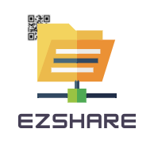
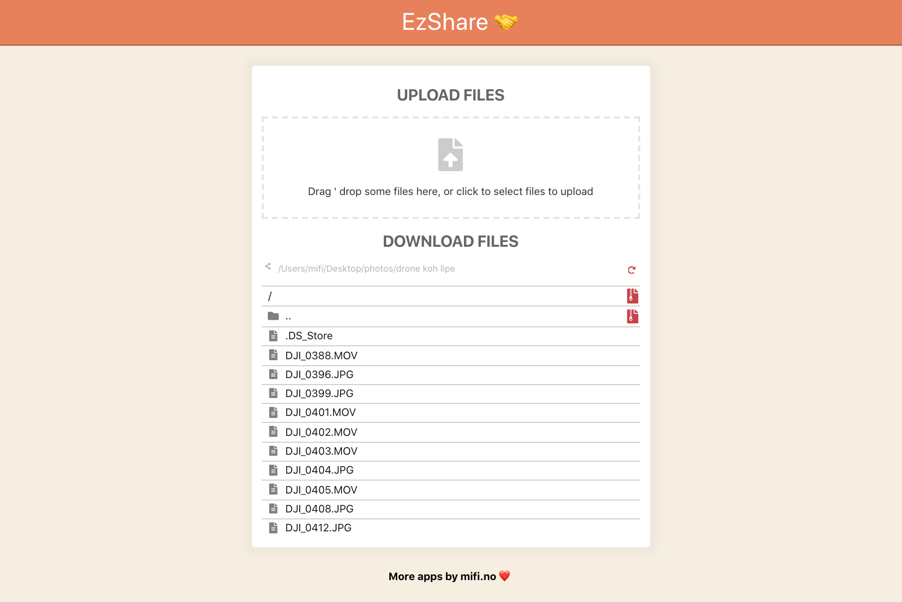

A simple **file server** that lets you easily share many big files like photos and videos with friends (or between your devices) over a local network without requiring an internet connection. It starts an HTTP server that lists all files and directories in the directory where it is started from. Then anyone can then connect to the server and download files or automatically generated ZIP of whole directories, kind of like a self hosted Google Drive. The client can also upload files to the server via their browser, and clipboard card be shared both ways. A QR code is generated for convenience.



## Features
- Local two-way transfers without going through the internet
- Send full quality photos and videos to others without needing a fast internet connection
- Handles really big files and directories
- Handles a LOT of files
- Auto ZIPs directories on-the-fly
- Two-way sharing of clipboard
- The web client works on all major platforms, including iOS and Android (however the server must run on a Mac/Windows/Linux computer)
- Video/image playback and slideshows

## Install (with Node.js / npm)

- Install [Node.js](https://nodejs.org) and open a terminal:

```bash
npm install -g ezshare
```

## Install (standalone)

If you don't want to install Node.js, you can download Electron based executable of `ezshare` from Releases.

## Migrate from v1 to v2

```bash
npm uninstall -g ezshare
npm i -g @ezshare/cli
```

## Usage

- Open a terminal and run:
- `cd /path/to/your/shared/folder`
- `ezshare`
- Open the browser in the other end to the printed URL
- Start to upload or download files to/from this folder!
- **Note** that the two devices need to be on the same WiFi (or possibly personal hotspot)

**Alternatively** you can pass it the path you want to share:
```bash
ezshare /your/shared/folder
```

For more info run `ezshare --help`

## Supported platforms
- The web client with all operating systems that have a modern browser. iOS, Android, Mac, Windows, ++
- The command line application works on all major desktop OS (Mac, Windows, Linux)

## Share over internet without NAT

If you want to share a file over internet, you can use a service like [Ngrok](https://ngrok.com/) or [Cloudflare tunnels](https://developers.cloudflare.com/cloudflare-one/connections/connect-apps/).

Ngrok:
```bash
ngrok http http://ip.of.ezshare:8080/
```

Cloudflare tunnel:
```bash
cloudflared tunnel --url http://ip.of.ezshare:8080/ --no-autoupdate
```

Then just share the URL you are given from one of these services.

More alternatives:
- https://github.com/anderspitman/awesome-tunneling

## Development

### Running CLI locally

```bash
yarn dev:cli
```

### Running Electron locally

```bash
yarn dev:electron
```

### Package locally

```bash
yarn build && yarn workspace @ezshare/electron package
```

## Release

First push and wait for green GitHub Actions.

Version whichever packages are changed:

```bash
yarn workspace @ezshare/web version patch
yarn workspace @ezshare/lib version patch
yarn workspace @ezshare/cli version patch
yarn workspace @ezshare/electron version patch

git add packages/*/package.json
git commit -m Release
```

Now build and publish to npm:

```bash
yarn build
yarn workspace @ezshare/web npm publish
yarn workspace @ezshare/lib npm publish
yarn workspace @ezshare/cli npm publish
```

Now trigger workflow dispatch to build the Electron version.
- Wait for GitHub Actions run
- Edit draft to add release notes, and check that artifacts got added.

## Credits
- Icon made by [Freepik](https://www.flaticon.com/authors/freepik) from [www.flaticon.com](https://www.flaticon.com/)

## See also
- https://github.com/claudiodangelis/qr-filetransfer
- https://github.com/shivensinha4/qr-fileshare

---

Made with ❤️ in 🇳🇴

[More apps by mifi.no](https://mifi.no/)

Follow me on [GitHub](https://github.com/mifi/), [YouTube](https://www.youtube.com/channel/UC6XlvVH63g0H54HSJubURQA), [IG](https://www.instagram.com/mifi.no/), [Twitter](https://twitter.com/mifi_no) for more awesome content!
